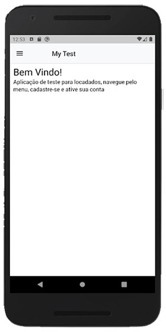
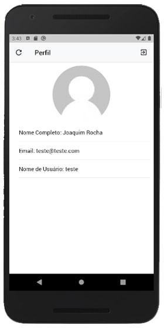

# MyTest
Aplicação de teste para locadados.

## Sumário
* [Tecnologias Utilizadas](#tecnologias-utilizadas)
* [Prints Mobile](#prints-mobile)

## Tecnologias Utilizadas

### Back-end API com TDD (https://geekmcz.com)
* Lavel/Lumen (https://lumen.laravel.com)
* PHPUnit (https://phpunit.de)
* JWT (https://jwt.io)

### Front-end (https://osor1o.github.io/MyTest)
* React (https://reactjs.org)
* Redux (https://redux.js.org)
* Redux-Form (https://redux-form.com)
* React Router (https://github.com/ReactTraining/react-router)
* React-bootstrap (https://react-bootstrap.github.io)
* axios (https://github.com/axios/axios)

### Mobile
* React Native (https://facebook.github.io/react-native)
* Redux (https://redux.js.org)
* Redux-Form (https://redux-form.com)
* React Navigation (https://reactnavigation.org)
* Native Base (https://nativebase.io)
* axios (https://github.com/axios/axios)

## Prints Mobile

